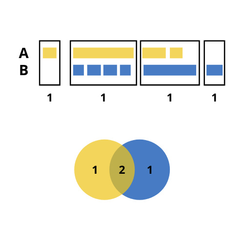

```{r setup, include=FALSE}
knitr::opts_chunk$set(echo = TRUE, fig.align = "center", fig.width = 4, fig.height = 4, 
                      warning = FALSE, error = FALSE, message = FALSE)
devtools::load_all("..")
library(dplyr)
library(purrr)

peak_list <- list.files("../testdata", "peak", full.names = T, recursive = T) %>%
  purrr::set_names(c("PeakX", "PeakY"))  %>%
  purrr::map(~read.delim(.x))
ggVennPeaks(peak_list = peak_list)
```

Last updated: `r Sys.Date()`

***

# Load `plotmics`

```{r results=FALSE}
# load plotmics
library(plotmics)
```

# Run `ggVennPeaks()`

`ggVennPeaks()` draws an Venn diagram plot with the intersections between different sets of peaks using the function `getVennCounts()` (which calls `ChIPpeakAnno::makeVennDiagram()`) and the `ggvenn` package.

Look at the [`ggvenn` package documentation](https://github.com/yanlinlin82/ggvenn).

Look at the [`makeVennDiagram()` function documentation](https://www.rdocumentation.org/packages/ChIPpeakAnno/versions/3.6.5/topics/makeVennDiagram).

## Required input

As input, `ggVennPeaks()` takes a named list of data frames with the columns `seqnames`, `start` and `end`.

```{r}
# read the peak annotation into a list
peak_list <- list.files("../testdata", "peak", full.names = T, recursive = T) %>%
  purrr::set_names(c("PeakX", "PeakY")) %>%
  purrr::map(~read.delim(.x))

peak_list[[1]][1:5, 1:7]
peak_list[[1]][10:30,]$strand = "+"
peak_list[[1]][50:80,]$strand = "-"
peak_list[[2]][10:30,]$strand = "+"
peak_list[[2]][50:80,]$strand = "-"

```

## `getVennCounts()`

`getVennCounts()` calls `ChIPpeakAnno::makeVennDiagram()`, retrieves the Venn counts (number of overlaps between different sets of peaks) and builds a matrix of the peaks present in each set.

```{r eval=FALSE}
venn_counts <- getVennCounts(peaks = peak_list)
```

```{r eval=FALSE}
venn_counts$vennCounts
#      PeakX PeakY Counts
# [1,]     0     0      0
# [2,]     0     1     70
# [3,]     1     0    977
# [4,]     1     1     23
# attr(,"class")
# [1] "VennCounts"
```

```{r eval=FALSE}
venn_counts$matrix[1:5,]
# peak    PeakX   PeakY
# peak1   0       1
# peak2	  0	      1
# peak3	  0	      1
# peak4	  0	      1
# peak5	  0	      1
```

`ggVennPeaks()` calls the function `getVennCounts()` and builds the Venn diagram using the peak matrix and the `ggvenn` package.

### Unexpected intersections

As mentioned, `ChIPpeakAnno::makeVennDiagram()` is called inside `getVennCounts()`. This function may have a unexpected outputs when considering the number of overlaps to build the intersection between different sets of regions. Considering the following example:

* We have two sets of regions named A and B: A has 4 regions, 3 of which overlap with regions in B; and B has 6 regions, 5 of which overlap with regions in A.
* In the case we consider the 5 regions from B that overlap with regions in A, the size of the resulting intersection (5) would be greater than the total size of A (4).
* To prevent that, the number of overlaps considered to build the intersection is the lowest possible. In our case, this is 2.
* Hence, with `ggVennCounts()` we would get 1 unique region from A, one unique region from B and 2 intersections. The sum of any of them is not the total size of A or B.

<center>

</center>

## Default run

```{r}
ggVennPeaks(peak_list)
```

## Customize plot

### Set names

```{r}
ggVennPeaks(peak_list, peak_names = c("Condition 1", "Condition 2"))
```

### Title and subtitle

```{r}
ggVennPeaks(peak_list, peak_names = c("Condition 1", "Condition 2"), 
            title = "This is a title", subtitle = "This is a subtitle")
```

### Remove percentage

```{r}
ggVennPeaks(peak_list, percent = F)
```

### Set colors

```{r}
ggVennPeaks(peak_list, in_fill = c("Green", "Darkred"))
```

```{r}
ggVennPeaks(peak_list, in_fill = c("Green", "Darkred"), alpha = .2)
```

### Other colors

```{r}
ggVennPeaks(peak_list, out_color = "blue")
```

```{r}
ggVennPeaks(peak_list, text_color = "red")
```

```{r}
ggVennPeaks(peak_list, name_color = c("red", "blue"))
```

### Text sizes

```{r}
ggVennPeaks(peak_list, label_size = 10)
```

```{r}
ggVennPeaks(peak_list, name_size = 10)
```

### Further costumization

Since `ggVennPeaks()` outputs a `ggvenn`-based Venn diagram and `ggvenn` is based in `ggplot2`, it can be further customized with `scales` or `theme`.
